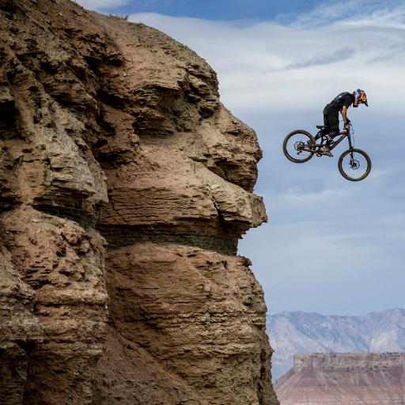
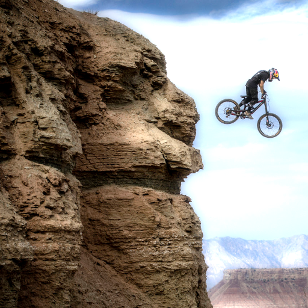

# post-treatment-gpu

Utilitary classes for image-processing: blur, bloom etc.  Using C++, SFML, OpenGL shaders.

# Directional blur

Directional gaussian blur.
Two parameters:
* force of the blur
* direction of the blur
 

# Gaussian blur

Gaussian blur for 2D images, implemented as two orthogonal directional blurs.

For better performance, the texture can be downscaled,
blurred and then upscaled. Typically, shrinking the blurred
texture by x2 enables x5,x6 performance for a visually equivalent result.

Measure performance, for x16 blur of a 512x512 image:

# Bright parts extractor

Extracts the bright parts of an image, sets the other parts to black.
Only the perceived brightness is taken into account:
perceived brightness = 0.299*red + 0.587*green + 0.114*blue.

# Bloom

Wikipedia:
The effect produces fringes (or feathers) of light extending from the borders of bright areas in an image.

Processes the image in three steps:
- extracts the bright parts to a buffer texture
- blurs the buffer
- adds the buffer to the original image

